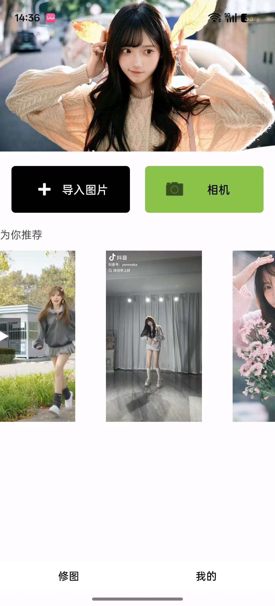

# 醒图 (XingTu)

<div align="center">


一个轻量级、高性能的 Android 图片编辑应用

[功能特性](#-功能特性) • [快速开始](#-快速开始) • [项目结构](#-项目结构) • [技术栈](#-技术栈)

</div>

---

## 项目简介

**醒图（XingTu）** 是一个简易修图 App，采用 Android 原生开发，使用 Kotlin 语言编写。项目旨在提供一个轻量级、高性能的图片编辑解决方案，支持图片浏览、编辑、裁剪和导出等核心功能。

### 核心特性

- **高性能渲染**：使用 OpenGL ES 2.0 实现图片渲染，流畅度高
- 多媒体支持**：支持图片和视频混合展示，视频可点击播放
- 智能权限管理**：适配 Android 13+ 新权限模型，兼容不同厂商设备
- **优化性能**：使用 MediaStore Thumbnails API 加载缩略图，相册浏览流畅
-  **用户体验**：支持撤销/重做功能，操作历史可追溯

### 使用场景

- **日常图片编辑**：用户可以从相册选择图片进行编辑
- **图片裁剪**：支持自由裁剪和固定比例裁剪
- **图片预览**：在首页浏览推荐的图片和视频内容
- **快速修图**：提供基础的缩放、平移、旋转等编辑功能

---

## 功能特性

### 首页模块

- 顶部轮播图自动播放（ViewPager2）
- 横向滑动媒体展示（图片 + 视频）
- MP4 视频播放（ExoPlayer）
- 多媒体预览（支持 JPEG、PNG、WebP）

### 相册页模块

- MediaStore API 异步查询图片和视频
- 3 列网格布局展示缩略图
- 权限管理（适配 Android 13+）
- 缩略图优化加载（5-20ms/张）

### 编辑器页模块

- OpenGL ES 2.0 渲染画布
- 双指缩放、单指平移、旋转功能
- 撤销/重做功能

### 导出功能模块

- FBO 离屏渲染合成结果
- MediaStore API 保存到相册
- 权限处理（适配 Android 13+）


---

## 🚀 快速开始

### 环境要求

- **Android Studio**：Hedgehog (2023.1.1) 或更高版本
- **JDK**：11 或更高版本
- **Android SDK**：API 24-36
- **Gradle**：8.0 或更高版本
- **最低支持版本**：Android 7.0 (API 24)
- **目标版本**：Android 14 (API 36)

### 克隆项目

```bash
git clone <repository-url>
cd XingTu
```

### 配置环境

1. **打开项目**
   - 打开 Android Studio
   - 选择 "Open an Existing Project"
   - 选择项目根目录 `XingTu`

2. **同步 Gradle**
   - Android Studio 会自动检测并提示同步 Gradle
   - 点击 "Sync Now" 或等待自动同步完成
   - 首次打开可能需要下载依赖，请耐心等待

3. **检查配置**
   - 确保已安装 Android SDK API 24-36
   - 确保已配置 JDK 11 或更高版本
   - 检查 `local.properties` 文件中的 `sdk.dir` 路径是否正确

### 构建项目

#### Debug 版本

```bash
# Windows
gradlew.bat assembleDebug

# macOS / Linux
./gradlew assembleDebug
```

构建产物位置：`app/build/outputs/apk/debug/app-debug.apk`

#### Release 版本

```bash
# Windows
gradlew.bat assembleRelease

# macOS / Linux
./gradlew assembleRelease
```

构建产物位置：`app/build/outputs/apk/release/app-release.apk`

#### 生成 AAB（Android App Bundle）

```bash
# Windows
gradlew.bat bundleRelease

# macOS / Linux
./gradlew bundleRelease
```

构建产物位置：`app/build/outputs/bundle/release/app-release.aab`

### 安装运行

#### 方式一：通过 Android Studio（推荐）

1. **连接设备**
   - 使用 USB 连接 Android 设备
   - 在设备上开启"USB 调试"模式
   - 或在 Android Studio 中启动模拟器

2. **运行应用**
   - 点击 Android Studio 工具栏的 "Run" 按钮（绿色三角形）
   - 或使用快捷键 `Shift + F10`（Windows/Linux）或 `Ctrl + R`（macOS）
   - 选择目标设备，点击 "OK"

3. **等待安装**
   - Android Studio 会自动编译、安装并启动应用
   - 首次安装可能需要几分钟时间

#### 方式二：通过命令行

```bash
# 安装 Debug 版本
adb install app/build/outputs/apk/debug/app-debug.apk

# 安装 Release 版本
adb install app/build/outputs/apk/release/app-release.apk

# 如果已安装，使用 -r 参数覆盖安装
adb install -r app/build/outputs/apk/debug/app-debug.apk
```

#### 方式三：直接安装 APK

1. **传输 APK**
   - 将 APK 文件传输到 Android 设备
   - 可以通过 USB、云盘、邮件等方式传输

2. **安装 APK**
   - 在设备上打开文件管理器
   - 找到 APK 文件
   - 点击安装（需要允许"未知来源"安装）

### 运行注意事项

1. **权限授予**
   - 首次打开相册页时，需要授予存储权限
   - Android 13+ 会弹出 `READ_MEDIA_IMAGES` 和 `READ_MEDIA_VIDEO` 权限请求
   - Android 12 及以下会弹出 `READ_EXTERNAL_STORAGE` 权限请求
   - 请务必授予权限，否则无法访问相册

2. **测试设备**
   - 建议在至少 2 台不同品牌的真机上测试（如小米、华为、Oppo、Vivo）
   - 确保在不同 Android 版本上测试（建议覆盖 Android 7.0-14）

3. **性能测试**
   - 测试相册加载大量图片时的性能
   - 测试编辑器处理大图片时的内存占用
   - 测试导出功能的耗时和成功率

---

## 📁 项目结构

```
XingTu/
├── app/
│   ├── src/
│   │   ├── main/
│   │   │   ├── java/com/bytedance/xingtu/
│   │   │   │   ├── MainActivity.kt              # 主 Activity，管理底部导航
│   │   │   │   ├── SplashActivity.kt             # 启动页
│   │   │   │   ├── BlankFragment1.kt             # 修图页 Fragment（首页）
│   │   │   │   ├── BlankFragment2.kt             # 灵感页 Fragment
│   │   │   │   ├── BlankFragment3.kt             # 我的页 Fragment
│   │   │   │   ├── AlbumActivity.kt              # 相册页 Activity
│   │   │   │   ├── EditorActivity.kt             # 编辑器页 Activity
│   │   │   │   ├── ImageRenderer.kt              # OpenGL ES 渲染器
│   │   │   │   ├── CropOverlayView.kt           # 裁剪框 View（自定义 View）
│   │   │   │   ├── MediaAdapter.kt              # 相册媒体适配器
│   │   │   │   ├── MixedMediaAdapter.kt          # 混合媒体适配器（视频+图片）
│   │   │   │   ├── VideoPlayerHolder.kt         # 视频播放器管理（单例）
│   │   │   │   ├── MediaItem.kt                 # 相册媒体项数据类
│   │   │   │   ├── MediaContentItem.kt           # 混合媒体内容项（密封类）
│   │   │   │   ├── EditState.kt                 # 编辑状态数据类
│   │   │   │   ├── EditHistoryManager.kt         # 操作历史管理
│   │   │   │   ├── ImageExt.kt                  # Bitmap 扩展函数（保存到相册）
│   │   │   │   └── ImagePagerAdapter.kt         # 轮播图适配器
│   │   │   ├── res/                              # 资源文件
│   │   │   │   ├── layout/                       # 布局文件
│   │   │   │   ├── drawable/                     # 图片资源
│   │   │   │   └── raw/                          # 视频和图片资源
│   │   │   └── AndroidManifest.xml               # 应用清单文件
│   │   └── test/                                 # 测试代码
│   ├── build.gradle.kts                          # 应用构建配置
│   └── proguard-rules.pro                        # 代码混淆规则
├── gradle/                                       # Gradle 配置
├── build.gradle.kts                              # 项目构建配置
├── settings.gradle.kts                           # 项目设置
├── gradle.properties                             # Gradle 属性
└── README.md                                     # 项目说明文档
```

---

## 🛠 技术栈

### 开发语言

- **Kotlin**：主要编程语言

### UI 框架

- **Android 原生 UI 控件**：RecyclerView、ViewPager2、ImageView 等
- **ViewBinding**：数据绑定

### 图形渲染

- **OpenGL ES 2.0**：图片渲染和变换

### 异步处理

- **Kotlin 协程**：异步任务处理（网络请求、文件 IO、媒体库查询）

### 媒体处理

- **ExoPlayer (Media3)**：视频播放
- **MediaStore API**：媒体库访问

### 架构模式

- **模块化设计**：首页、相册页、编辑器页独立模块
- **MVVM**：部分模块采用 MVVM 模式

---

## 📋 功能列表

### 首页模块

- [x] 顶部轮播图自动播放（ViewPager2）
- [x] 横向滑动媒体展示（RecyclerView）
- [x] MP4 视频播放（ExoPlayer）
- [x] 图片预览（JPEG、PNG、WebP）
- [x] 导入图片按钮
- [x] 自动轮播控制
- [x] 播放器管理（单例模式）

### 相册页模块

- [x] MediaStore API 异步查询
- [x] 3 列网格布局
- [x] 权限管理（Android 13+ 适配）
- [x] 缩略图优化加载
- [x] 点击跳转编辑器
- [x] 厂商适配（小米、华为等）

### 编辑器页模块

- [x] OpenGL ES 2.0 渲染画布
- [x] 双指缩放（0.1x - 5.0x）
- [x] 单指平移
- [x] 旋转功能（90 度）
- [x] 等比例裁剪（1:1、3:4、9:16）
- [x] 自由裁剪
- [x] 撤销/重做功能
- [x] 重置功能

### 导出功能模块

- [x] FBO 离屏渲染
- [x] MediaStore API 保存到相册
- [x] 权限处理（Android 13+ 适配）
- [x] 文件命名（时间戳）

---

## ⚙️ 配置说明

### 权限配置

应用需要在 `AndroidManifest.xml` 中声明以下权限：

```xml
<!-- Android 13+ (API 33+) -->
<uses-permission android:name="android.permission.READ_MEDIA_IMAGES" />
<uses-permission android:name="android.permission.READ_MEDIA_VIDEO" />

<!-- Android 12 及以下 (API ≤ 32) -->
<uses-permission
    android:name="android.permission.READ_EXTERNAL_STORAGE"
    android:maxSdkVersion="32" />

<!-- Android 12 及以下需要写权限（导出功能） -->
<uses-permission
    android:name="android.permission.WRITE_EXTERNAL_STORAGE"
    android:maxSdkVersion="32" />
```

### 依赖库

主要依赖库已在 `app/build.gradle.kts` 中配置：

```kotlin
dependencies {
    // AndroidX 核心库
    implementation(libs.androidx.core.ktx)
    implementation(libs.androidx.appcompat)
    implementation(libs.material)
    implementation(libs.androidx.activity)
    implementation(libs.androidx.constraintlayout)
    implementation(libs.androidx.viewpager2)
    
    // RecyclerView
    implementation("androidx.recyclerview:recyclerview:1.3.2")
    
    // Kotlin 协程
    implementation("org.jetbrains.kotlinx:kotlinx-coroutines-android:1.7.3")
    
    // ExoPlayer (Media3)
    implementation("androidx.media3:media3-exoplayer:1.2.0")
    implementation("androidx.media3:media3-ui:1.2.0")
}
```

## 

## 核心功能截图

### 首页模块



---

### 相册页模块


---

### 编辑器页模块


---


---

### 导出功能模块


---

## 📝 开发说明

### 代码规范

- 使用 Kotlin 编码规范
- 遵循 Android 开发最佳实践
- 关键代码部分有排查日志信息

### 调试工具

- **Android Studio Debugger**：用于问题定位
- **Android Studio Profiler**：用于定位内存泄漏、CPU 峰值和卡顿根源

### 测试建议

- 在不同 Android 版本上测试（Android 7.0-14）
- 在不同品牌设备上测试（小米、华为、Oppo、Vivo 等）
- 测试大图片的编辑和导出性能
- 测试视频播放的流畅性和资源释

---

本项目采用 MIT 许可证。详情请参阅 [LICENSE](LICENSE) 文件。

欢迎提交 Issue 和 Pull Request！

---

## 📧 联系方式

如有问题或建议，请通过以下方式联系：

- 提交 Issue：[GitHub Issues](https://github.com/your-repo/issues)
- 邮箱：3373661337@qq.com

---

<div align="center">


**醒图 (XingTu)** - 让图片编辑更简单

Made with ❤️ using Kotlin

</div>

